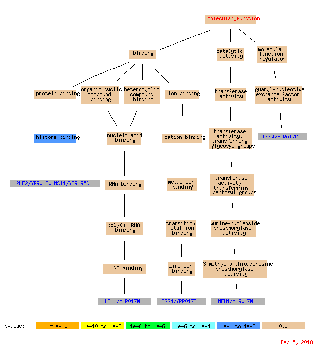

```{r setup, include=FALSE}
knitr::opts_chunk$set(
    echo = TRUE,
    message = FALSE,
    warning = FALSE
)
```

#Sol1
#General network features
The general network features like #edges, #nodes, radius etc are shown in Table 1.
```{r, tidy=TRUE}
library("igraph")
library(readxl)
library("MCL")
Y2H_uni<-read.table('Y2H_uniondata.txt')
graph_Y2H_uni<-graph.data.frame(as.matrix(Y2H_uni),directed = FALSE)
graph_Y2H_uni_Details<-c(ecount(graph_Y2H_uni), vcount(graph_Y2H_uni), graph.density(graph_Y2H_uni),diameter(graph_Y2H_uni), radius(graph_Y2H_uni), transitivity(graph_Y2H_uni, type = "global"),transitivity(graph_Y2H_uni, type = "average"),mean_distance(graph_Y2H_uni))

CCSB_YI1<-read.table('CCSB_YI1.txt')
graph_CCSB_YI1<-graph.data.frame(as.matrix(CCSB_YI1),directed = FALSE)
graph_CCSB_YI1_Details<-c(ecount(graph_CCSB_YI1), vcount(graph_CCSB_YI1), graph.density(graph_CCSB_YI1),diameter(graph_CCSB_YI1), radius(graph_CCSB_YI1), transitivity(graph_CCSB_YI1, type = "global"),transitivity(graph_CCSB_YI1, type = "average"),mean_distance(graph_CCSB_YI1))

#wtite to table
header1<-c("#Edges","#Vertices","Density","Diameter","Radius","Clustering_coeff(global)","Clustering_coeff(avg)","Avg Shortest Path")
tab1<-data.frame(Feature=header1,Y2H_uni=graph_Y2H_uni_Details,CCSB_YI1=graph_CCSB_YI1_Details)
tab1 %>% knitr::kable(caption = "Graph Features")
```

#Testing for small world property
In a small world network most of the nodes can be reached by other nodes in only a short number of hops. In a small-world network the typical distance D between two randomly chosen nodes grows proportionally to the logarithm of the number of nodes N in the network, that is $$D \sim log(N)$$
It is difficult to statistically test whether a given a network is small-world or not. Here I used the approach as described by Watts and Strogatz (Watts and Strogatz. Nature 393. 1998). We can compare small world network with a random network with the same number on nodes and vertices. We expect that a small world network will have higher clustering coeff than coressponding random network and the avg shortest path is expected to be greater in small world networks than random network. So, I randomized the given networks 3 times to see if the conditions hold.

I observed that the Agv. shortest path in the random networks is longer than the given networks in all three cases. Also, the clustering coefficient of the given networks is greater than those of the random networks in all three cases. Thus, only one condition is satisfied and it is difficult to say with confidence that these networks are small world or not. 

```{r, tidy=TRUE}
#generate 3 random netwroks for each graph
rn1a <- erdos.renyi.game(vcount(graph_Y2H_uni), ecount(graph_Y2H_uni),type='gnm')
rn1b <- erdos.renyi.game(vcount(graph_Y2H_uni), ecount(graph_Y2H_uni),type='gnm')
rn1c <- erdos.renyi.game(vcount(graph_Y2H_uni), ecount(graph_Y2H_uni),type='gnm')
rn2a <- erdos.renyi.game(vcount(graph_CCSB_YI1), ecount(graph_CCSB_YI1),type='gnm')
rn2b <- erdos.renyi.game(vcount(graph_CCSB_YI1), ecount(graph_CCSB_YI1),type='gnm')
rn2c <- erdos.renyi.game(vcount(graph_CCSB_YI1), ecount(graph_CCSB_YI1),type='gnm')

#get cc and mean dist
cc1a <- transitivity(rn1a, type = "global")
cc1b <- transitivity(rn1b, type = "global")
cc1c <- transitivity(rn1c, type = "global")
cc2a <- transitivity(rn2a, type = "global")
cc2b <- transitivity(rn2b, type = "global")
cc2c <- transitivity(rn2c, type = "global")

md1a <- mean_distance(rn1a)
md1b <- mean_distance(rn1b)
md1c <- mean_distance(rn1c)
md2a <- mean_distance(rn2a)
md2b <- mean_distance(rn2b)
md2c <- mean_distance(rn2c)

header2<-c("Clustering_coeff(global)","Avg Shortest Path")
tab2<-data.frame(Network=header2,Y2H_uni_randomized_a=c(cc1a,md1a),Y2H_uni_randomized_b=c(cc1b,md1b),Y2H_uni_randomized_c=c(cc1c,md1c),CCSB_YI1_randomized_a=c(cc2a,md2a),CCSB_YI1_randomized_b=c(cc2b,md2b),CCSB_YI1_randomized_c=c(cc2c,md2c))
tab2<-t(tab2)
tab2 %>% knitr::kable(caption = "Clustering Coeff and Avg shortest path in random networks")

```

#Testing for power law (scale-free) property
To test if the networks follow powerlaw we first plot the degree distribution to visually see if the degree distribution can be a power law. Then we can use the function *power.law.fit* from igraph package and then reject or accept the null hypothesis, that degree distribution is sampled from a scle free distribution, at a confidence level using the p-value reported.
Looking at Fig. 1 which shows the degree distributions of the networks, we can say that both networks follow power law. Then, Table 3. shows the result of *power.law.fit* function. I observed high p-values which indicates that the degree distributions follow a power law. Also the reported power law exponent is between 2 and 3, which strongly suggests that these networks are scale free.

```{r, fig.cap=c("Degree distributions of graphs(log-log scale)"),tidy=TRUE}
#plot degree dist
par(mfrow=c(1,3))
plot(degree.distribution(graph_Y2H_uni),xlab = "log(k)",ylab = "log(P(k))",log="xy",type='o',main = "a: Degree Distribution Y2H_uni")
plot(degree.distribution(graph_CCSB_YI1),xlab = "log(k)",ylab = "log(P(k))",log="xy",type='o',main = "b: Degree Distribution CCSB_YI1")
g_powlaw <- barabasi.game(1000)
plot(degree.distribution(g_powlaw),xlab = "log(k)",ylab = "log(P(k))",log="xy",type='o',main = "c: Powerlaw distribution")

#use powerlaw fit
fitA <- power.law.fit(degree(graph_Y2H_uni,mode="all"),implementation="plfit") 
fitB <- power.law.fit(degree(graph_CCSB_YI1,mode="all"),implementation="plfit") 
fitC <- power.law.fit(degree(g_powlaw,mode="all"),implementation="plfit") 
head3<-c("Y2H_uni","CCSB_YI1","Powerlaw graph")
tab3<-data.frame(Graph=head3,Alpha=c(fitA$alpha,fitB$alpha,fitC$alpha),X_min=c(fitA$xmin,fitB$xmin,fitC$xmin),KS_stat=c(fitA$KS.stat,fitB$KS.stat,fitC$KS.stat),P_Value=c(fitA$KS.p,fitB$KS.p,fitC$KS.p),logLik=c(fitA$logLik,fitB$logLik,fitC$logLik))
tab3 %>% knitr::kable(caption = "Power law fits")

```

#Finding hubs
Hubs are the nodes which have high degree in the network. To find the hubs we first empirically decide a degree such that any node having higher degree is a hub. To do this we plot the degree distribution of the network and set a threshhold such that probability of higher degree is lower. From Fig. 2 and 3 we decide that any node having degree more than 11 in Y2H_uni network is a hub and a node having degree more than 10 in CCSB_YI1 network is a hub.

I found two hubs in Y2H_uni and two hubs in CCSB_YI1 which are present in the Yeast_deletion project. These two hubs were the same for both the networks (see Table 4.). They are *YPL031c* and *YLR423c*. The ORF *YPL031c* is described as "cyclin-dependent protein kinase" and *YLR423c* is defind as "protein involved in authophagy".


```{r, fig.cap=c("Degree distribution Y2H_uni","Degree distribution CCSB_YI1"),tidy=TRUE}


#first plot degree dist to find degree threshhold
plot(degree.distribution(graph_Y2H_uni),type = "l", xlab = "Degree",main = "Degree distribution Y2H_uni", xaxt="n")
axis(side=1, at=c(0:100))
plot(degree.distribution(graph_CCSB_YI1),type = "l", xlab = "Degree",main = "Degree distribution CCSB_YI1", xaxt="n")
axis(side=1, at=c(0:100))

#find hubs in the networks
hubs_Y2H_uni<-names(which(degree(graph_Y2H_uni)>11))
hubs_CCSB_YI1<-names(which(degree(graph_CCSB_YI1)>10))
#hubs_common <- intersect(hubs_Y2H_uni,hubs_CCSB_YI1)
#read yeast deletion data
Yeast_deletionProject <- read_excel("Yeast_deletionProject.xlsx")
#remove extra whitespace from first col
ORFs_Yeast_proj <- as.data.frame(apply(Yeast_deletionProject,2,function(x)gsub('\\s+', '',x)))$ORF
#find common ORFs
hubs_common_Y2H_uni <- intersect(hubs_Y2H_uni,ORFs_Yeast_proj)
hubs_common_CCSB_YI1 <- intersect(hubs_CCSB_YI1,ORFs_Yeast_proj)
hubs_common <- intersect(hubs_common_CCSB_YI1,hubs_common_Y2H_uni)
head4<-c("Y2H_uni","CCSB_YI1","Intersection")
tab4<-data.frame(Network=head4,Hubs_common=c(paste(hubs_common_Y2H_uni,collapse = ","), paste(hubs_common_CCSB_YI1,collapse = ","),paste(hubs_common,collapse = ",")))

tab4 %>% knitr::kable(caption = "Hubs in the network common with YeastDeletion Project data")

```

Next, to test the significance of hubs, I took, randomly, a set of genes and checked whether at least 2 of them will appear in the yeast deletion project or not. The number of genes were same as the number of hubs found in the network i.e. 55 for Y2H_uni and 40 for CCSB_YI1 and since I found 2 genes from the hubs essential I am checking how likely it is it to sample a subset and get 2 or more genes in the essential gene list. For each of these networks, I chose set of genes then checked if at least 2 of them were present in the yeast deletion project. I repeated this process 100 times. My null hypothesis is that nodes chosen at random are essential. I define my test statistic as #observations where essential gene are more than or equal to 2.

From my test, I get a very high p-value (0.8) which suggests that from any randomly chosen set of genes, there could be a at least N number of genes present in the essential gene list, where N is the number of essential genes which are also hubs. Thus, it implies that grouping genes by centrality doesn't make them essential and if we select a random set of genes they are also equally or more probable to be present in the essential gene list.


```{r,tidy=TRUE}
#test essentiality are randomly selected genes essential?
N=100
n1=length(hubs_Y2H_uni)
C1<-length(hubs_common_Y2H_uni)
T1=0
#repeat N times
nodes_Y2H<-names(degree(graph_Y2H_uni))
for(i in 1:N ){
  #print(i)
  #sample n1 genes from Y2H_uni
  thissample <- sample(nodes_Y2H,n1)
  intersect(thissample,ORFs_Yeast_proj)
  if(length(intersect(thissample,ORFs_Yeast_proj)) >= C1){
    T1=T1+1
  }
  
}

print ("Pvalue is")
print (T1/N)


```


#Sol1 c
The Yu paper reports that the networks are scale free and follows power law. I observed the same in this report. The Yu paper found around 90 of essential genes overlapping with their central genes. However, in my report I only found 2 which is contradictory to Yu paper.

#Sol 2
Table 5. shows the various properties of the BioGrid network. This network has greater number of nodes as compared to Y2H and CCSB networks. This graph is denser than the other two and has global clustering coeff of 0.0428, which is higher as compared to other networks. I further checked the degree distribution and whether it follows power law or not. The results are in Table 6 which shows the results of the function power.law.fit on the three networks. We can see that all networks have comparable $\alpha$ and high p-values. This means BioGrid network also follows power law and is scale-free.

I also checked whether the BioGrid network behave likes a small world network. The results in Table 7 show that clustering coeff of BioGrid network is greater than that of a random network with same density but the mean shortest path is shorter than that of the random network. This is exactly same behaviour as of the other two networks i.e. Y2H_uni and CCSB_YI1. Based on these observations, we can say that the BioGrid network is pretty similar to the other smaller networks. 

Looking at these properties we can safely assume that we are dealing with scale-free networks as even larger networks have very similar properties to the smaller ones.

```{r, fig.cap=c("Degree distribution BioGrid18"), tidy=TRUE}
#read BioGrid2018_uni-2
BioGrid18_data<-read.table('BioGrid2018_uni-2.txt')
graph_BioGrid18<-graph.data.frame(as.matrix(BioGrid18_data),directed = FALSE)
graph_BioGrid18_Details<-c(ecount(graph_BioGrid18), vcount(graph_BioGrid18), graph.density(graph_BioGrid18),diameter(graph_BioGrid18), radius(graph_BioGrid18), transitivity(graph_BioGrid18, type = "global"),transitivity(graph_BioGrid18, type = "average"),mean_distance(graph_BioGrid18))
head5<-c("#Edges","#Vertices","Density","Diameter","Radius","Clustering_coeff(global)","Clustering_coeff(avg)","Avg Shortest Path")
tab5<-data.frame(Feature=head5,BioGrid18=graph_BioGrid18_Details)
tab5 %>% knitr::kable(caption = "BioGrid Network Features")

plot(degree.distribution(graph_BioGrid18),xlab = "log(k)",ylab = "log(P(k))",log="xy",type='o')
fitD <- power.law.fit(degree(graph_BioGrid18,mode="all"),implementation="plfit") 
head6<-c("Y2H_uni","CCSB_YI1","BioGrid18")
tab6<-data.frame(Graph=head3,Alpha=c(fitA$alpha,fitB$alpha,fitD$alpha),X_min=c(fitA$xmin,fitB$xmin,fitD$xmin),KS_stat=c(fitA$KS.stat,fitB$KS.stat,fitD$KS.stat),P_Value=c(fitA$KS.p,fitB$KS.p,fitD$KS.p),logLik=c(fitA$logLik,fitB$logLik,fitD$logLik))
tab6 %>% knitr::kable(caption = "BioGrid Network Powerlaw fit results")

#check for small world
#generate 3 random netwroks for each graph
rn3a <- erdos.renyi.game(vcount(graph_BioGrid18), ecount(graph_BioGrid18),type='gnm')
cc3a <- transitivity(rn3a, type = "global")
md3a <- mean_distance(rn3a)
head7<-c("Clustering_coeff(global)","Avg Shortest Path")
tab7<-data.frame(Feature=head7,BioGrid18=c(transitivity(graph_BioGrid18, type = "global"),mean_distance(graph_BioGrid18)),Random_Net=c(cc3a,md3a))
tab7 %>% knitr::kable(caption = "BioGrid Network vs Random Network")
```


#Sol3a

First I found the largest connected components of each graph. Table 8. shows the properties of the largest connected component of each graph.

Then I found the hubs using betweenness centrality, see Table 9. I found 82 hubs for Y2H network and 48 hubs for CCSB network. I assumed that the top 5% nodes having higher betweenness measure are hubs. From the results we see that there were 3 genes from Y2H network and only 1 gene from CCSBYI1 network which was essential. Interestingly this gene was also present as essential in Y2H network. These genes have following functions
* *YLR423C* protein involved in authophagy
* *YKL002W* class E vacuolar-protein sorting and endocytosis factor
* *YPL031C* cyclin-dependent protein kinase

We can also see that *YLR423C* and *YPL031C* were also found using degree centrality.

Since I found so low number of common genes, it implies that there is no correlation between the gene having high betweenness centrality and being essential.

```{r, tidy=TRUE}
getLargestCC<-function(g)
{
  #decompose graph into connected comps
  decomp<-decompose.graph(g)
  #say first component is largest
  largest<-decomp[[1]]
  for(i in 1:length(decomp))
  {
    thisg <- decomp[[i]]
    #if there is largere component
    if( vcount(thisg) > vcount(largest) )
    {
      largest <- thisg
    }
  }
  #return largest
  return(largest)
}

graph_Y2H_uni_lcc <- getLargestCC(graph_Y2H_uni)
graph_CCSB_YI1_lcc <- getLargestCC(graph_CCSB_YI1)
graph_BioGrid18_lcc <- getLargestCC(graph_BioGrid18)
graph_Y2H_uni_lcc_Details<-c(ecount(graph_Y2H_uni_lcc), vcount(graph_Y2H_uni_lcc), graph.density(graph_Y2H_uni_lcc),diameter(graph_Y2H_uni_lcc), radius(graph_Y2H_uni_lcc), transitivity(graph_Y2H_uni_lcc, type = "global"),transitivity(graph_Y2H_uni_lcc, type = "average"),mean_distance(graph_Y2H_uni_lcc))
graph_CCSB_YI1_lcc_Details<-c(ecount(graph_CCSB_YI1_lcc), vcount(graph_CCSB_YI1_lcc), graph.density(graph_CCSB_YI1_lcc),diameter(graph_CCSB_YI1_lcc), radius(graph_CCSB_YI1_lcc), transitivity(graph_CCSB_YI1_lcc, type = "global"),transitivity(graph_CCSB_YI1_lcc, type = "average"),mean_distance(graph_CCSB_YI1_lcc))
graph_BioGrid18_lcc_Details<-c(ecount(graph_BioGrid18_lcc), vcount(graph_BioGrid18_lcc), graph.density(graph_BioGrid18_lcc),diameter(graph_BioGrid18_lcc), radius(graph_BioGrid18_lcc), transitivity(graph_BioGrid18_lcc, type = "global"),transitivity(graph_BioGrid18_lcc, type = "average"),mean_distance(graph_BioGrid18_lcc))
#wtite to table
head8<-c("#Edges","#Vertices","Density","Diameter","Radius","Clustering_coeff(global)","Clustering_coeff(avg)","Avg Shortest Path")
tab8<-data.frame(Feature=head8,Y2H_uni_lcc=graph_Y2H_uni_lcc_Details,CCSB_YI1_lcc=graph_CCSB_YI1_lcc_Details,BioGrid_lcc=graph_BioGrid18_lcc_Details)
tab8 %>% knitr::kable(caption = "Largest connected component properties")

#find most essential genes by betweenness
#Assuming Top 5% are essential
bw_Y2H_uni_lcc<-betweenness(graph_Y2H_uni_lcc,directed = F)
bw_CCSB_YI1_lcc<-betweenness(graph_CCSB_YI1_lcc,directed = F)
bw_Y2H_uni_lcc<-names(head(sort(bw_Y2H_uni_lcc,decreasing = T),vcount(graph_Y2H_uni_lcc)*0.05))
bw_CCSB_YI1_lcc<-names(head(sort(bw_CCSB_YI1_lcc,decreasing = T),vcount(graph_CCSB_YI1_lcc)*0.05))
#find common with Yeast_deletion data
bw_common_Y2H_uni <- intersect(bw_Y2H_uni_lcc,ORFs_Yeast_proj)
bw_common_CCSB_YI1 <- intersect(bw_CCSB_YI1_lcc,ORFs_Yeast_proj)
bw_common <- intersect(bw_common_Y2H_uni,bw_common_CCSB_YI1)
head9<-c("Y2H_uni_lcc","CCSB_YI1_lcc","Intersection")
tab9<-data.frame(Network=head4,Hubs_common=c(paste(bw_common_Y2H_uni,collapse = ","), paste(bw_common_CCSB_YI1,collapse = ","),paste(bw_common,collapse = ",")))
tab9 %>% knitr::kable(caption = "Essential hubs found using betweenness")

print("Hubs by betweennes in Y2H_uni_lcc")
bw_Y2H_uni_lcc
print("Hubs by betweennes in CCSB_YI1_lcc")
bw_CCSB_YI1_lcc

```


#Sol3b 

I created additional 4 networks by removing 10% and 25% of edges randomly from Y2H and CCSB networs. Then, I used the R package *MCL* to do the MCL clustering. Table 10. and 11 shows the number of clusters which I got from these different networks. I further found the largest clusters in these networks and compared then within each group that is Y2H_uni and CCSB_YI1 See Table 12. For the three networks in Y2H_uni group i.e. the largest connected component of Y2H_uni and two networks which were obtaind by removing 10% and 25% edges, the largest clusters have 8 common genes. In CCSB there was only one common gene, *YPR113w*, among the three largest clusters which was also present in largest clusters of Y2H_uni networks. I also found intersection of largest clusters of Y2H_uni and CCSB_YI1 networks and found that only two genes over lap i.e. *YHL004w* and *YPR113w*. I also observed that after removing edges randomly the size of largest cluster became larger and total number of cluster went down.
To see complete list of these genes please see the code snippet.


```{r, tidy=TRUE}
#run MCL on networks
adj_Y2H_uni_lcc<- as_adj(graph_Y2H_uni_lcc, type = "both", attr = NULL,edges = FALSE, names = TRUE)
Y2H_uni_lcc_mcl <- mcl(x = adj_Y2H_uni_lcc, addLoops=TRUE, ESM = TRUE)
#randomly remove 10% and 25% edges
graph_Y2H_uni_lcc_10<-delete.edges(graph_Y2H_uni_lcc, head(sample(E(graph_Y2H_uni_lcc)),ecount(graph_Y2H_uni_lcc)*0.10))
graph_Y2H_uni_lcc_25<-delete.edges(graph_Y2H_uni_lcc, head(sample(E(graph_Y2H_uni_lcc)),ecount(graph_Y2H_uni_lcc)*0.25))
adj_Y2H_uni_lcc_10<- as_adj(graph_Y2H_uni_lcc_10, type = "both", attr = NULL,edges = FALSE, names = TRUE)
adj_Y2H_uni_lcc_25<- as_adj(graph_Y2H_uni_lcc_25, type = "both", attr = NULL,edges = FALSE, names = TRUE)
Y2H_uni_lcc_mcl_10 <- mcl(x = adj_Y2H_uni_lcc_10, addLoops=TRUE, ESM = TRUE)
Y2H_uni_lcc_mcl_25 <- mcl(x = adj_Y2H_uni_lcc_25, addLoops=TRUE, ESM = TRUE)
head10<-c("Y2H_uni_lcc","Y2H_uni_lcc_10","Y2H_uni_lcc_25")
tab10<-data.frame(Network=head10,Num_clusters=c(Y2H_uni_lcc_mcl$K,Y2H_uni_lcc_mcl_10$K,Y2H_uni_lcc_mcl_25$K),Num_iter=c(Y2H_uni_lcc_mcl$n.iterations,Y2H_uni_lcc_mcl_10$n.iterations,Y2H_uni_lcc_mcl_25$n.iterations))
tab10 %>% knitr::kable(caption = "MCL result on Y2H's largest CC")
#for CCSB network
adj_CCSB_YI1_lcc<- as_adj(graph_CCSB_YI1_lcc, type = "both", attr = NULL,edges = FALSE, names = TRUE)
CCSB_YI1_lcc_mcl <- mcl(x = adj_CCSB_YI1_lcc, addLoops=TRUE, ESM = TRUE)
#randomly remove 10% and 25% edges
graph_CCSB_YI1_lcc_10<-delete.edges(graph_CCSB_YI1_lcc, head(sample(E(graph_CCSB_YI1_lcc)),ecount(graph_CCSB_YI1_lcc)*0.10))
graph_CCSB_YI1_lcc_25<-delete.edges(graph_CCSB_YI1_lcc, head(sample(E(graph_CCSB_YI1_lcc)),ecount(graph_CCSB_YI1_lcc)*0.25))
adj_CCSB_YI1_lcc_10<- as_adj(graph_CCSB_YI1_lcc_10, type = "both", attr = NULL,edges = FALSE, names = TRUE)
adj_CCSB_YI1_lcc_25<- as_adj(graph_CCSB_YI1_lcc_25, type = "both", attr = NULL,edges = FALSE, names = TRUE)
CCSB_YI1_lcc_mcl_10 <- mcl(x = adj_CCSB_YI1_lcc_10, addLoops=TRUE, ESM = TRUE)
CCSB_YI1_lcc_mcl_25 <- mcl(x = adj_CCSB_YI1_lcc_25, addLoops=TRUE, ESM = TRUE)
head11<-c("CCSB_YI1_lcc","CCSB_YI1_lcc_10","CCSB_YI1_lcc_25")
tab11<-data.frame(Network=head11,Num_clusters=c(CCSB_YI1_lcc_mcl$K,CCSB_YI1_lcc_mcl_10$K,CCSB_YI1_lcc_mcl_25$K),Num_iter=c(CCSB_YI1_lcc_mcl$n.iterations,CCSB_YI1_lcc_mcl_10$n.iterations,CCSB_YI1_lcc_mcl_25$n.iterations))
tab11 %>% knitr::kable(caption = "MCL result on CCSB_YI1's largest CC")

#find largest clusters in Y2h components
findlargestcluster<-function(graph,mcldata){
  res<-0
  cres<-V(graph)[ which(mcldata$Cluster %in% c(0))]
  t<-mcldata$K
  for(i in c(0:t))
    #print (i)
    thiscluster<-V(graph)[ which(mcldata$Cluster %in% c(i))]$name
    #print (length(thiscluster))
    if(length(thiscluster) > length(cres)){
      cres <- thiscluster
      res <- i
    }
  return(cres)
}
print("Largest clusters in Y2H_uni_lcc networks")
lc_Y2H_uni_lcc_mcl<-findlargestcluster(graph_Y2H_uni_lcc,Y2H_uni_lcc_mcl)
lc_Y2H_uni_lcc_mcl
lc_Y2H_uni_lcc_mcl_10<-findlargestcluster(graph_Y2H_uni_lcc_10,Y2H_uni_lcc_mcl_10)
lc_Y2H_uni_lcc_mcl_10
lc_Y2H_uni_lcc_mcl_25<-findlargestcluster(graph_Y2H_uni_lcc_25,Y2H_uni_lcc_mcl_25)
lc_Y2H_uni_lcc_mcl_25

lc_Y2H<-intersection(lc_Y2H_uni_lcc_mcl,lc_Y2H_uni_lcc_mcl_10,lc_Y2H_uni_lcc_mcl_25)
print("Intersection of largest clusters in Y2H_uni_lcc networks")
lc_Y2H
print("Largest clusters in CCSB_YI1_lcc networks")
lc_CCSB_YI1_lcc_mcl<-findlargestcluster(graph_CCSB_YI1_lcc,CCSB_YI1_lcc_mcl)
lc_CCSB_YI1_lcc_mcl
lc_CCSB_YI1_lcc_mcl_10<-findlargestcluster(graph_CCSB_YI1_lcc_10,CCSB_YI1_lcc_mcl_10)
lc_CCSB_YI1_lcc_mcl_10
lc_CCSB_YI1_lcc_mcl_25<-findlargestcluster(graph_CCSB_YI1_lcc_25,CCSB_YI1_lcc_mcl_25)
lc_CCSB_YI1_lcc_mcl_25
lc_CCSB<-intersection(lc_CCSB_YI1_lcc_mcl,lc_CCSB_YI1_lcc_mcl_10,lc_CCSB_YI1_lcc_mcl_25)
print("Intersection of largest clusters in CCSB_YI1_lcc networks")
lc_CCSB

head12<-c("lc_Y2H_uni_lcc_mcl","lc_Y2H_uni_lcc_mcl_10","lc_Y2H_uni_lcc_mcl_25","lc_CCSB_YI1_lcc_mcl","lc_CCSB_YI1_lcc_mcl_10","lc_CCSB_YI1_lcc_mcl_25")
tab12<-data.frame(ClusterIn=head12,Size_of_largest_cluster=c(length(lc_Y2H_uni_lcc_mcl),length(lc_Y2H_uni_lcc_mcl_10),length(lc_Y2H_uni_lcc_mcl_25),length(lc_CCSB_YI1_lcc_mcl),length(lc_CCSB_YI1_lcc_mcl_10),length(lc_CCSB_YI1_lcc_mcl_25)))
tab12 %>% knitr::kable(caption = "Comparision of clusters found by MCL")

```

#Sol 3c

I randomly chose the cluster number 21 in Y2H's largest connected component network. This cluster had 4 genes. Then, i checked to GO terms using https://www.yeastgenome.org/cgi-bin/GO/goTermFinder.pl. In the results I found that 4 out of 4 genes were associated with GO term binding and 2 genes were associated with Histone binding both cases p-value was lower that 0.05. It does seems like that this cluster of gene are involved in similar functions although rigorous analysis is required to further confirm this.



```{r, tidy=TRUE}
#get all genes in cluster 21
c1_graph_Y2H_uni_lcc <- as.data.frame(V(graph_Y2H_uni_lcc)[ which(Y2H_uni_lcc_mcl$Cluster %in% c(21))]$name)
c1_graph_Y2H_uni_lcc

library(readr)
GOres <- read_delim("GOres.txt", "\t", escape_double = FALSE, trim_ws = TRUE)
print("GO term search results:")
GOres
```
