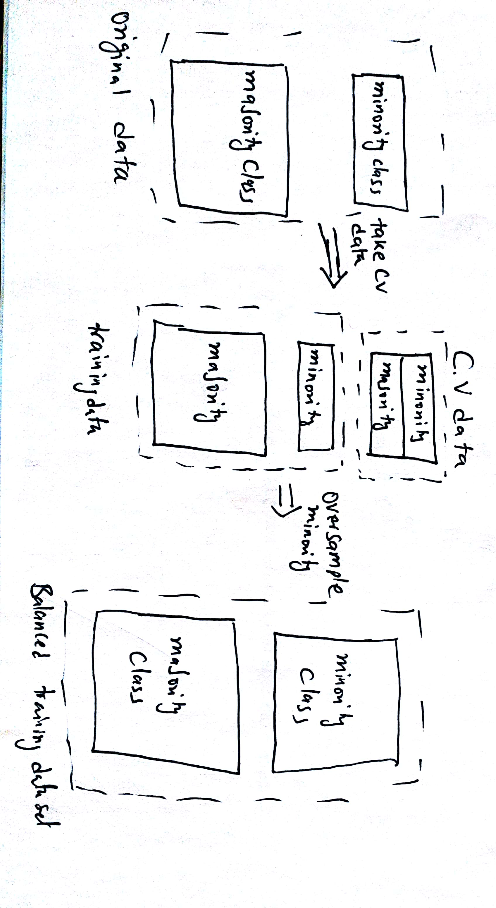

```{r setup, include=FALSE}
knitr::opts_chunk$set(
    echo = TRUE,
    message = FALSE,
    warning = FALSE
)
```

# Solution 1

a) If we have imbalanced classes we can use over sampling of the minority class to balance our data set. one easy way to oversample the minority class is to just duplicate the exixting samples in the minority class. If we over sample before crossvalidation step, then we will potentially overfit our model. Thus, first we need to take out our validation set and then over-sample the remaining minority classes in the training data. A flow chart is shown below.

```{r pressure, echo=FALSE, fig.cap="Flowchart for oversampling minority class", out.width = '100%'}

```

b) The SVM code and output is attached below. First, I am taking out 10% cv dataset and then i am doing oversampling on the remaining data to get a training set. I compute average accuraccy on the cv data sets to choose the best C. The details of the best model found is generated. 

```{r,tidy=TRUE}
source('general.R')
library(kernlab)
library(ROCR)
library(lattice)
library(readr)


##############Solution 1################
# Load the Protein Prediction dataset as text file
fdata <- read.csv('C_elegans_acc_gc.csv', header =FALSE, col.names = c("class","GCIntron(after)", "GC Exon"))
#balance class by under sampling
num_pos<-length(which(fdata$class==1))
num_neg<-length(which(fdata$class==-1))
#balance class by oversampling
fdata_neg<-fdata[which(fdata$class==-1),]
fdata_pos<-fdata[which(fdata$class==1),]
N<-5
#initialize c list
clist <- 2^seq(-1,10)
errrbf<-c()
bestMod<-NULL
bestAcc<--1
predList<-c()
labList<-c()
for(c in clist){
  cvErrs<-c()
  for(i in(1:N)){
    #create a balanced cross val dataset
    cv<-data.frame(matrix(ncol = length(fdata), nrow = 0))
    colnames(cv)<-colnames(fdata)
    #sample 10% of data from pos class and equal amount from neg class to make cv set
    n_cv<-as.integer(num_pos*0.1)
    ## set the seed to make your partition reproductible
    set.seed(41*i+i**2)
    cv_ind <- sample(seq_len(nrow(fdata_pos)), size = n_cv)
    cv_pos <- fdata_pos[cv_ind, ]
    train_pos <- fdata_pos[-cv_ind, ]
    cv_ind <- sample(seq_len(nrow(fdata_neg)), size = n_cv)
    cv_neg <- fdata_neg[cv_ind, ]
    train_neg <- fdata_neg[-cv_ind, ]
    
    #final CV
    cv<-rbind(cv_pos,cv_neg)
    
    #over sample the remaining pos class by replicating randomly
    osize=length(train_neg$class)-length(train_pos$class)
    oversamp_ind<-sample(seq_len(nrow(fdata_pos)), size = osize,replace = T)
    tr_pos_os<-train_pos[oversamp_ind,]
    train_pos<-rbind(train_pos,tr_pos_os)
    train_set<-rbind(train_pos,train_neg)
    
    #####start training#######
    y <- train_set$class
    x <- train_set[c(2:length(train_set))]
    x <- as.matrix(sapply(x, as.numeric))
    n<-length(y)
    #train SVM model
    svp <- ksvm(x,y,type="C-svc",kernel="rbf",C=c,scaled=c())
    # General summary
    svp
    xtest<-cv[c(2:length(cv))]
    ytest<-cv$class
    ypred = predict(svp,xtest)
    predList<-cbind(predList,ypred)
    labList<-cbind(labList,ytest)
    # Confusion table
    cm<-table(ytest,ypred)
    acc<-sum(diag(cm))/length(ytest)
    #cat("Accuraccy:",acc*100,"%")
    thisErr<-1-acc
    #print(thisErr)
    cvErrs<-c(cvErrs,thisErr)
  }
  errrbf<-c(errrbf, mean(cvErrs))
  if(bestAcc<(1-mean(cvErrs))){
    bestAcc<-1-mean(cvErrs)
    bestMod<-svp
  }
  
}
pred.mat <- prediction(predList, labels = labList )
#plot CV ROCs
many.roc.perf = performance(pred.mat, measure = "tpr", x.measure = "fpr")
plot(many.roc.perf,main="ROC plot for cv sets",col=1,lwd=1)
abline(a=0, b= 1)


plot(clist,errrbf,type='l',ylim=c(0,0.2),xlab="C",ylab="Error rate",col=1,lwd=2,main='CrossValidaton error')
grid()
legend("topright",c('RBF'),lwd=2,col=c(1))
bestC<--2
bestC<-clist[which.min(errrbf)]
cat("Best C:",bestC,"from RBF using balanced schillingData, Err:", min(errrbf))
bestMod
```


# Solution 2

The code and output for SVM is attached below. The best model was found using 5-fold cv. Then, the best model was usen on 764 data to test. The test accuraccy and other metrics are shown below.

```{r,tidy=TRUE}
#################Solution 2###################
##Read data
X1625Data_encoded <- read_csv("1625Data_encoded.txt")
#firsc col is class
y <- X1625Data_encoded$`data11$V2`
x <- X1625Data_encoded[c(2:length(X1625Data_encoded))]
x <- as.matrix(sapply(x, as.numeric))
n<-length(y)
N<-5
#initialize c list
clist <- 2^seq(-1,10)
errlin <- c()
predList<-c()
labList<-c()

bestMod<-NULL
bestAcc<--1
##implement cross validation
for(c in clist){
  cvErrs<-c()
  for(i in(1:N)){
    #split data into train and cross
    tindex <- sample(n,round(n*.9)) # indices of training samples to plot
    xtrain <- x[tindex,]
    xtest <- x[-tindex,]
    ytrain <- y[tindex]
    ytest <- y[-tindex]
    istrain=rep(0,n)
    istrain[tindex]=1
    
    #####start training#######
   
    svp <- ksvm(xtrain,ytrain,type="C-svc",kernel='vanilladot',C=c)
    ypred = predict(svp,xtest)
    predList<-cbind(predList,ypred)
    labList<-cbind(labList,ytest)
    # Confusion table
    cm<-table(ytest,ypred)
    acc<-sum(diag(cm))/length(ytest)
    #cat("Accuraccy:",acc*100,"%")
    thisErr<-1-acc
    #print(thisErr)
    cvErrs<-c(cvErrs,thisErr)
    
  }
 
   errlin<-c(errlin, mean(cvErrs))
  if(bestAcc<(1-mean(cvErrs))){
    bestAcc<-1-mean(cvErrs)
    bestMod<-svp
  }
  
}

pred.mat <- prediction(predList, labels = labList )
#plot CV ROCs
many.roc.perf = performance(pred.mat, measure = "tpr", x.measure = "fpr")
plot(many.roc.perf,main="ROC plot for cv sets",col=1,lwd=1)
abline(a=0, b= 1)


plot(clist,errlin,type='l',ylim=c(0,0.1),xlab="C",ylab="Error rate",col=1,lwd=2,main='CrossValidaton error')
grid()
legend("topright",c('Linear'),lwd=2,col=c(1))
bestC<--2
bestC<-clist[which.min(errlin)]
cat("Best C:",bestC,"from linear, Err:", min(errlin))
svp<- ksvm(xtrain,ytrain,type="C-svc",kernel='vanilladot',C=bestC)


#open test set
X746Data_encoded <- read_csv("746Data_encoded.txt")
testy<-X746Data_encoded$`data11$V2`
testx<-X746Data_encoded[c(2:length(X746Data_encoded))]
test_pred<- predict(svp,testx)
cm<-table(testy,test_pred)
acc<-sum(diag(cm))/length(testy)
cat("Accuraccy on 764 data:",acc*100,"%")
pred <- prediction(test_pred,testy)
# Plot ROC curve
perf <- performance(pred, measure = "tpr", x.measure = "fpr") 
plot(perf,title="TPR vs. FPR")
abline(a=0, b= 1)
auc<- performance(pred, measure = "auc")
cat("AUC ROC:",unlist(auc@y.values)[1])
# Plot precision/recall curve
perf <- performance(pred, measure = "prec", x.measure = "rec") 
plot(perf,title="Precision-Recall")
```


# Solution 3 

The code and outputs are attached below. First, I am taking out 10% cv dataset and then i am doing oversampling on the remaining data to get a training set. I compute average accuraccy on the cv data sets to choose the best C. The details of the best model found is generated. Then using the best model i predicted on 1625 data. The accuracy and other metrics are shown below. 


```{r,tidy=TRUE}
##############solution 3
#read data
schillingData_encoded <- read_csv("schillingData_encoded.txt")
#balance class by under sampling
num_pos<-length(which(schillingData_encoded$`data11$V2`==1))
num_neg<-length(which(schillingData_encoded$`data11$V2`==-1))
#balance class by oversampling
schillingData_neg<-schillingData_encoded[which(schillingData_encoded$`data11$V2`==-1),]
schillingData_pos<-schillingData_encoded[which(schillingData_encoded$`data11$V2`==1),]
N<-5
#initialize c list
clist <- 2^seq(-1,10)
errrbf<-c()
bestMod<-NULL
bestAcc<--1
predList<-c()
labList<-c()
for(c in clist){
  cvErrs<-c()
  for(i in(1:N)){
    #create a balanced cross val dataset
    cv<-data.frame(matrix(ncol = 161, nrow = 0))
    colnames(cv)<-colnames(schillingData_encoded)
    #sample 10% of data from pos class and equal amount from neg class to make cv set
    n_cv<-as.integer(num_pos*0.1)
    ## set the seed to make your partition reproductible
    set.seed(41*i+i**2)
    cv_ind <- sample(seq_len(nrow(schillingData_pos)), size = n_cv)
    cv_pos <- schillingData_pos[cv_ind, ]
    train_pos <- schillingData_pos[-cv_ind, ]
    cv_ind <- sample(seq_len(nrow(schillingData_neg)), size = n_cv)
    cv_neg <- schillingData_neg[cv_ind, ]
    train_neg <- schillingData_neg[-cv_ind, ]
    
    #final CV
    cv<-rbind(cv_pos,cv_neg)
    
    #over sample the remaining pos class by replicating randomly
    osize=length(train_neg$`data11$V2`)-length(train_pos$`data11$V2`)
    oversamp_ind<-sample(seq_len(nrow(schillingData_pos)), size = osize,replace = T)
    tr_pos_os<-train_pos[oversamp_ind,]
    train_pos<-rbind(train_pos,tr_pos_os)
    train_set<-rbind(train_pos,train_neg)
    
    #####start training#######
    y <- train_set$`data11$V2`
    x <- train_set[c(2:length(train_set))]
    x <- as.matrix(sapply(x, as.numeric))
    n<-length(y)
    #train SVM model
    svp <- ksvm(x,y,type="C-svc",kernel="rbf",C=c,scaled=c())
    # General summary
    svp
    xtest<-cv[c(2:length(train_set))]
    ytest<-cv$`data11$V2`
    ypred = predict(svp,xtest)
    predList<-cbind(predList,ypred)
    labList<-cbind(labList,ytest)
    # Confusion table
    cm<-table(ytest,ypred)
    acc<-sum(diag(cm))/length(ytest)
    #cat("Accuraccy:",acc*100,"%")
    thisErr<-1-acc
    #print(thisErr)
    cvErrs<-c(cvErrs,thisErr)
    
  }
  errrbf<-c(errrbf, mean(cvErrs))
  if(bestAcc<(1-mean(cvErrs))){
    bestAcc<-1-mean(cvErrs)
    bestMod<-svp
  }
  
}

pred.mat <- prediction(predList, labels = labList )
#plot CV ROCs
many.roc.perf = performance(pred.mat, measure = "tpr", x.measure = "fpr")
plot(many.roc.perf,main="ROC plot for cv sets",col=1,lwd=1)
abline(a=0, b= 1)

plot(clist,errrbf,type='l',ylim=c(0,0.2),xlab="C",ylab="Error rate",col=1,lwd=2,main='CrossValidaton error')
grid()
legend("topright",c('RBF'),lwd=2,col=c(1))
bestC<--2
bestC<-clist[which.min(errrbf)]
cat("Best C:",bestC,"from RBF using balanced schillingData, Err:", min(errrbf))
bestMod

##predict on test data 
#read test set
X1625Data_encoded <- read_csv("1625Data_encoded.txt")
testy<-X1625Data_encoded$`data11$V2`
testx<-X1625Data_encoded[c(2:length(X1625Data_encoded))]
test_pred<- predict(bestMod,testx)
cm<-table(testy,test_pred)
acc<-sum(diag(cm))/length(testy)
cat("Accuraccy on 1625 data using schillingData model:",acc*100,"%")
pred <- prediction(test_pred,testy)
# Plot ROC curve
perf <- performance(pred, measure = "tpr", x.measure = "fpr") 
plot(perf,title="TPR vs. FPR")
abline(a=0, b= 1)
auc<- performance(pred, measure = "auc")
cat("AUC ROC:",unlist(auc@y.values)[1])
# Plot precision/recall curve
perf <- performance(pred, measure = "prec", x.measure = "rec") 
plot(perf,title="Precision-Recall")
```


# 3b 

I found the errors were of same magnitude falling in the range 0.10-0.15.


